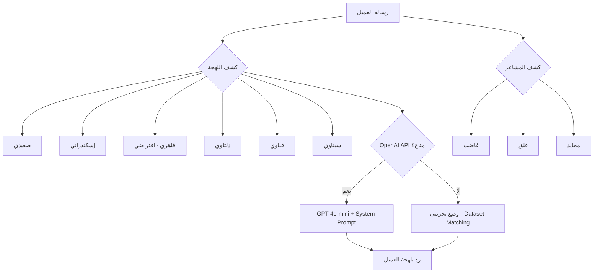
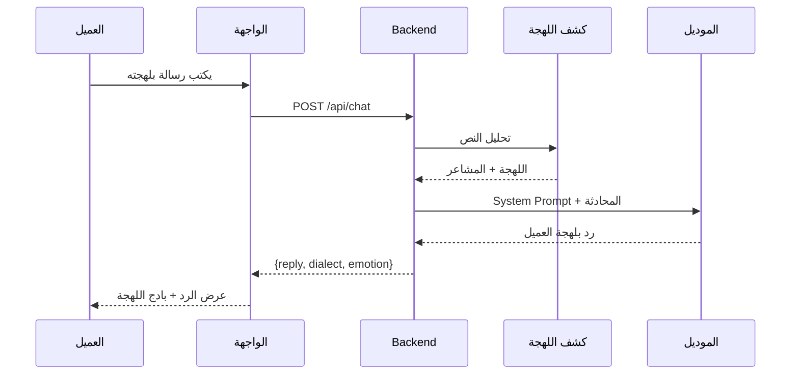

# تقرير مشروع: نظام خدمة عملاء مصري ذكي متعدد اللهجات
# Egyptian Dialect Customer Service Bot - Project Report

---

## ملخص المشروع

نظام خدمة عملاء ذكي يدعم **6 لهجات مصرية** مختلفة، مربوط بموديل ذكاء اصطناعي (OpenAI GPT-4o-mini) وداتا سيت تدريب. النظام بيكتشف لهجة العميل تلقائياً ويرد عليه بنفس لهجته.

---

## هيكل المشروع

```
egyptian-cs-bot/
├── backend/
│   ├── app.py              # FastAPI server + API endpoints
│   └── system_prompt.py    # System prompt بالعربي
├── frontend/
│   └── index.html          # واجهة الشات (RTL, glassmorphism)
├── dataset/
│   └── egyptian_cs_dataset.json   # 20 محادثة × 6 لهجات
├── fine_tune.py            # سكريبت التدريب (LoRA + OpenAI export)
├── requirements.txt        # المكتبات المطلوبة
├── .env                    # إعدادات API
└── run.bat                 # سكريبت التشغيل
```

---

## المكونات الأساسية

### 1. الداتا سيت ([egyptian_cs_dataset.json](file:///C:/Users/Nasef/.gemini/antigravity/scratch/egyptian-cs-bot/dataset/egyptian_cs_dataset.json))

| الخاصية | التفاصيل |
|---------|----------|
| عدد المحادثات | 20 محادثة |
| اللهجات | صعيدي، إسكندراني، قاهري، دلتاوي، قناوي، سيناوي/بدوي |
| المجالات | اتصالات، بنوك، تجارة إلكترونية، توصيل، مرافق، دعم فني، رعاية صحية، خدمات حكومية |
| المشاعر | neutral, frustrated, angry, worried, confused, formal |
| الهيكل | كل محادثة فيها: id, dialect, domain, emotion, conversation[] |

> [!NOTE]
> الداتا سيت دي نقطة بداية. كل ما تزود أمثلة أكتر كل ما الموديل يتحسن. الهدف إنك توصل لـ 500+ محادثة على الأقل للتدريب الجيد.

### 2. الـ Backend ([app.py](file:///C:/Users/Nasef/.gemini/antigravity/scratch/egyptian-cs-bot/backend/app.py))



**الـ API Endpoints:**

| Endpoint | Method | الوظيفة |
|----------|--------|---------|
| `/` | GET | يقدم واجهة الشات |
| `/api/health` | GET | حالة الاتصال والموديل |
| `/api/chat` | POST | إرسال رسالة واستقبال الرد |
| `/api/dataset` | GET | عرض الداتا سيت |
| `/api/dialects` | GET | قائمة اللهجات المدعومة |

**كشف اللهجة (Rule-Based):**
- بيدور على كلمات مفتاحية زي "يا حاج"، "يا صاحبي"، "يا باشا"
- لو ماقدرش يحدد → يرجع للقاهري كلهجة افتراضية
- الموديل نفسه كمان بيكتشف اللهجة من الـ System Prompt

**كشف المشاعر:**
- كلمات زي "زهقت"، "مش هينفع" → غضب
- كلمات زي "خايف"، "قلقان" → قلق
- غير كده → محايد

### 3. الواجهة الأمامية ([index.html](file:///C:/Users/Nasef/.gemini/antigravity/scratch/egyptian-cs-bot/frontend/index.html))

- **تصميم RTL** كامل للعربي
- **Glassmorphism** مع خلفية متحركة
- **شريط جانبي** فيه: اللهجات المدعومة، مجال الخدمة، حالة الاتصال
- **أمثلة سريعة** للتجربة الفورية
- **بادجات ذكية** بتوضح اللهجة المكتشفة والمشاعر
- **تصميم متجاوب** يشتغل على الموبايل والكمبيوتر

### 4. سكريبت التدريب ([fine_tune.py](file:///C:/Users/Nasef/.gemini/antigravity/scratch/egyptian-cs-bot/fine_tune.py))

بيدعم طريقتين:

#### أ) تدريب محلي (Local Fine-Tuning)
```
python fine_tune.py --mode local --model aubmindlab/aragpt2-base --epochs 5
```
- بيستخدم **LoRA** (Low-Rank Adaptation) للتدريب الفعال
- بيوفر في الذاكرة والوقت
- الموديل الأساسي: **AraGPT2** (متخصص في العربي)
- النتيجة: موديل مخصص لخدمة العملاء المصرية

#### ب) تصدير لـ OpenAI (JSONL Export)
```
python fine_tune.py --mode openai-export
```
- بيحول الداتا سيت لصيغة JSONL
- جاهز للرفع على OpenAI Fine-Tuning API
- بيستخدم للتدريب على GPT-3.5/GPT-4o-mini

---

## طريقة التشغيل

### الطريقة السريعة (وضع تجريبي بدون API)
```bash
# 1. ثبت المكتبات
pip install fastapi uvicorn openai

# 2. شغل السيرفر
cd egyptian-cs-bot/backend
python -m uvicorn app:app --port 8000 --reload

# 3. افتح المتصفح على http://localhost:8000
```

### الطريقة الكاملة (مع OpenAI API)
```bash
# 1. حط الـ API Key في ملف .env
OPENAI_API_KEY=sk-your-key-here

# 2. شغل run.bat
# أو:
cd backend
set OPENAI_API_KEY=sk-your-key-here
python -m uvicorn app:app --port 8000 --reload
```

> [!IMPORTANT]
> بدون API Key، النظام يشتغل في **وضع تجريبي** ويرد من الداتا سيت مباشرة. مع الـ API Key، الموديل بيولد ردود ذكية ومخصصة.

---

## اللهجات المدعومة

| اللهجة | المنطقة | علامات الكشف | نبرة الرد |
|--------|---------|-------------|----------|
| صعيدي | صعيد مصر | يا ولدي، يا حاج، والنبي | دافية، تحترم الكبار |
| إسكندراني | الإسكندرية | يا صاحبي، يا وحش، يا معلم | مباشرة، إيقاع سريع |
| قاهري | القاهرة (افتراضي) | يا باشا، يا فندم، خلاص | حضرية، فعالة |
| دلتاوي | الدلتا | يا جدع، يا ابني، ياخي | هادية، دافية |
| قناوي | قناة السويس | يا معلم | عملية، مباشرة |
| سيناوي/بدوي | سيناء | يا شيخ، يا أخوي | متزنة، تشريفية |

---

## كيف النظام بيشتغل (Flow)



---

## التطوير المستقبلي

> [!TIP]
> خطوات مقترحة لتحسين النظام:

1. **توسيع الداتا سيت** - اجمع 500+ محادثة حقيقية من كل لهجة
2. **إضافة STT** - ربط ميكروفون للتحويل الصوتي المباشر
3. **تدريب موديل مخصص** - استخدم الـ fine-tuning script مع بيانات أكتر
4. **إضافة TTS** - تحويل الرد لصوت بلهجة العميل
5. **Dashboard تحليلي** - إحصائيات عن اللهجات والمشاعر والمجالات
6. **Integration** - ربط بأنظمة CRM حقيقية
7. **Multi-turn Memory** - ذاكرة محادثة أطول مع Summarization

---

## المكتبات المستخدمة

| المكتبة | الاستخدام |
|---------|----------|
| FastAPI | Web server و API |
| OpenAI | ربط بموديل GPT-4o-mini |
| Transformers | تحميل وتدريب الموديلات |
| PEFT (LoRA) | تدريب فعال بذاكرة أقل |
| Datasets | تحميل وتحضير البيانات |
| PyTorch | محرك التدريب |
